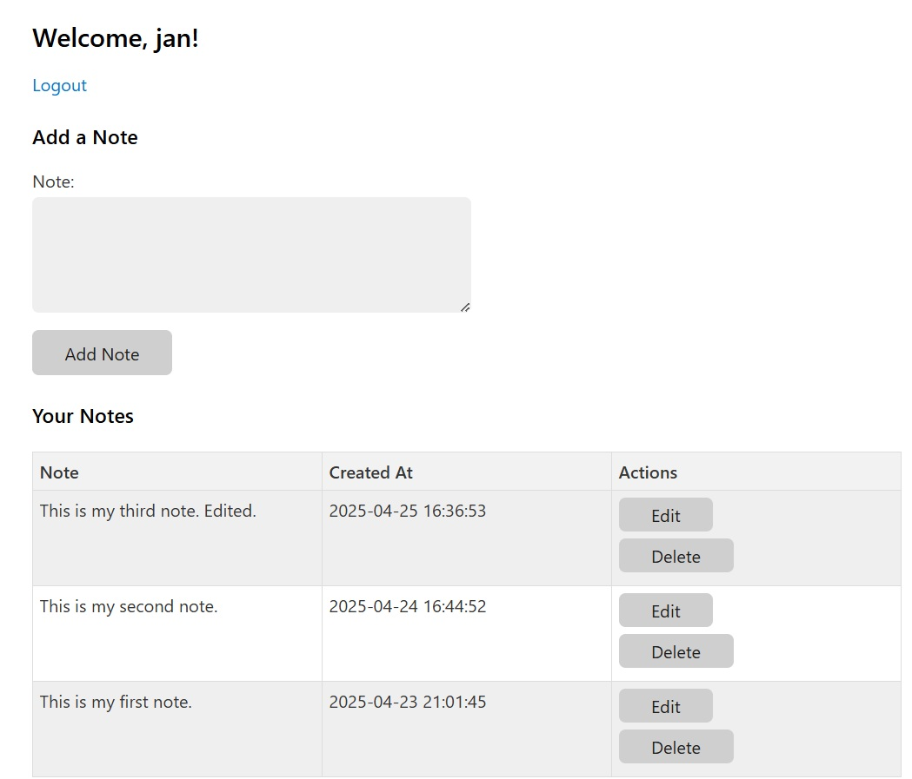

# Php login/registration system

Here we have an example of a PHP login and registration system using MySQL for storage, functionality to allow logged-in users to add notes to a MySQL database. This includes basic functionality with security considerations like password hashing and prepared statements to prevent SQL injection, CSRF protection (CSRF regeneration and timeout).

-----

